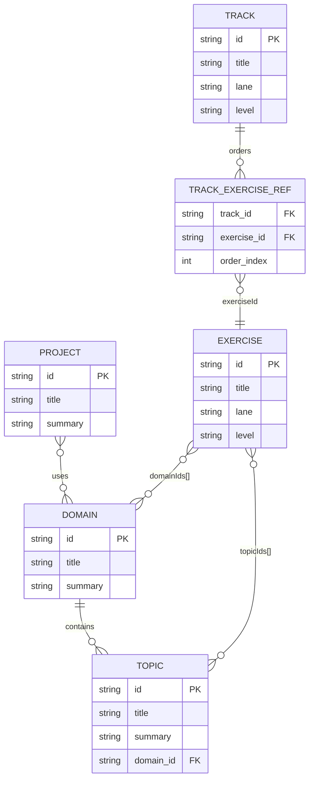

# Content Library (Sample) — ERD + Seed Tables

Mục tiêu: có 1 file Markdown dùng để **tham khảo schema + seed data** cho các entity:
`project`, `domain`, `topic`, `exercise`, `track`.

> Ghi chú: repo hiện dùng schema v2 cho catalog (`tracks`, `exercises`, `topics`, `domains`, `skills`).
> Entity `project` bên dưới là **conceptual** để nhóm theo “app/product idea” (AWS marketplace, Amazon-like, Todo, Twitter…).

---

## ERD (conceptual)



---

## Markdown table template (copy/paste)

```md
| id | title | summary |
|---|---|---|
| example-id | Example Title | One-line summary |
```

---

## Seed tables (sample)

### Domains

| id | title | summary |
|---|---|---|
| transaction-service | Transactional Service | Payments, ledger updates, and transactional workflows. |
| messaging-system | Messaging System | Queues, delivery orchestration, retries, and async dispatch. |
| scheduler-service | Scheduler Service | Cron/recurrence, delayed jobs, reminders, and due-queue processing. |
| collaboration-suite | Collaboration | Sharing, permissions, realtime presence, and concurrent edits. |
| social-network | Social Network (Twitter-like) | Feeds, timelines, notifications, and fan-out tradeoffs. |
| ecommerce-platform | E-commerce Platform (Amazon-like) | Catalog search, cart/checkout, pricing, and fulfillment events. |
| saas-marketplace | SaaS Marketplace (AWS-like) | Tenant catalogs, vendor payouts, and product listing workflows. |
| todo-app | Todo App | Lists, assignments, reminders, and sharing basics. |
| automation-trading | Trading Platform | Signals, order execution safeguards, and risk limits. |
| flashcard-learning | Anki-like Learning | Note import, scheduling, due queues, and retention workflows. |

### Topics

| id | title | summary | domain_id |
|---|---|---|---|
| sql | SQL | Query shaping, filtering, joins, pagination. | ecommerce-platform |
| access-control | Access Control | Ownership, sharing rules, permission checks. | collaboration-suite |
| event-driven | Event-driven Systems | Signals, deduplication, replay-safe processing. | messaging-system |
| idempotency | Idempotency | Duplicate detection, one-time transitions. | transaction-service |
| concurrency | Concurrency | Coordinating work across workers/requests safely. | collaboration-suite |
| booking-calendar | Calendar/Slots | Time windows, overlap checks. | scheduler-service |

### Projects (conceptual)

| id | title | summary |
|---|---|---|
| aws-like-saas-marketplace | AWS-like SaaS Marketplace | Multi-tenant marketplace + billing + vendor payouts. |
| amazon-like-ecommerce | Amazon-like E-commerce | Catalog search → cart → checkout → order events. |
| todo-collab-app | Todo App | Personal + shared lists, assignments, reminders. |
| twitter-like-social | Twitter-like Social | Timeline, fan-out, notifications, moderation basics. |
| trading-platform | Trading Platform | Risk-limited order execution + event intake. |
| anki-like-app | Anki-like Flashcards | Review scheduling, deck stats, note import. |

### Tracks (sample)

| id | title | lane | level | domainIds | exerciseRefs (ids) |
|---|---|---|---|---|---|
| project_ecommerce_starter | E-commerce Starter Track | project | foundation | [ecommerce-platform] | [project_list_products, project_apply_pricing_rules] |
| project_todo_collab_starter | Todo + Collaboration Starter | project | foundation | [todo-app, collaboration-suite] | [project_share_todo_list, project_schedule_reminders] |

### Exercises (sample)

| id | title | lane | level | topicIds | domainIds | tags |
|---|---|---|---|---|---|---|
| project_list_products | List products with filters | project | foundation | [sql] | [ecommerce-platform] | [list, query, pagination] |
| project_apply_pricing_rules | Apply pricing rules | project | foundation | [pricing] | [ecommerce-platform] | [pricing, rules] |
| project_share_todo_list | Share a todo list safely | project | foundation | [access-control] | [todo-app, collaboration-suite] | [share, permission] |
| project_schedule_reminders | Schedule reminder jobs idempotently | project | foundation | [idempotency, event-driven] | [scheduler-service] | [scheduler, retry] |

